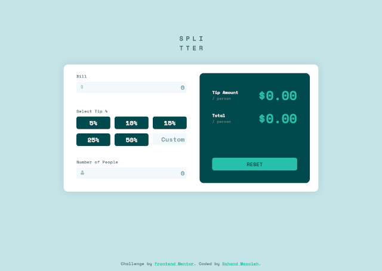
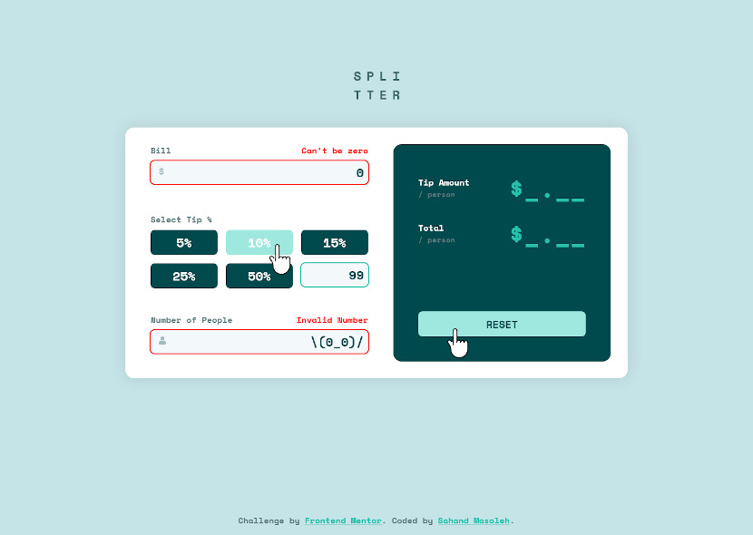

# Frontend Mentor - Tip calculator app solution

This is a solution to the [Tip calculator app challenge on Frontend Mentor](https://www.frontendmentor.io/challenges/tip-calculator-app-ugJNGbJUX). Frontend Mentor challenges help you improve your coding skills by building realistic projects.

## Table of contents

- [Overview](#overview)
  - [The challenge](#the-challenge)
  - [Screenshot](#screenshot)
  - [Links](#links)
  - [Built with](#built-with)
- [Author](#author)

## Overview

Users should be able to:

- View the optimal layout for the app depending on their device's screen size
- See hover states for all interactive elements on the page
- Calculate the correct tip and total cost of the bill per person

### Screenshot

### Links

- Solution URL: [Github](https://github.com/sahand-masoleh/fem-21-tip-calculator-app)
- Live Site URL: [Github Pages](https://sahand-masoleh.github.io/fem-21-tip-calculator-app)

### Built with

- HTML
- CSS
- Vanilla JS

## Author

- Frontend Mentor - [@sahand-masoleh](https://www.frontendmentor.io/profile/sahand-masoleh)
- Twitter - [@SahandMasoleh](https://twitter.com/SahandMasoleh)
